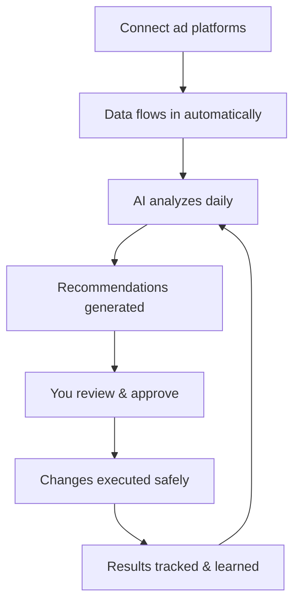

# Palitra

### AI-powered optimization for performance marketing teams

Palitra cuts daily per-client optimization from **1-2 hours to 5-10 minutes**. Connect your ad platforms, set goals, and let the AI handle analysis, recommendations, and execution — with your approval on every action.

---

## The problem

Performance marketers spend most of their day on repetitive tasks: pulling reports, comparing metrics, adjusting bids, pausing underperformers, adding negative keywords. This work is critical but mechanical — and it doesn't scale. Every new client means more hours, more hires, more context switching.

## How Palitra solves it

**One interface for everything.** Chat with the AI to analyze campaigns across all channels, or set up automated workflows that run daily — collecting data, finding issues, generating recommendations, and waiting for your approval before making changes.

**The AI learns from results.** Every optimization is tracked: what was changed, what happened after. The system builds a history of what works and what doesn't for each project — and uses it to make better recommendations over time.

**You stay in control.** Nothing happens without approval. Review recommendations in the web app, Telegram, or Slack — approve, reject, or adjust. Safety guardrails prevent risky changes automatically.

## Key capabilities

**Conversational analytics** — ask questions about your campaigns in natural language. "What's my CPA trend for search campaigns this month?" The AI queries your data directly and responds with tables and charts.

**Autonomous agent mode** — describe a complex task ("Optimize bids for all campaigns where CPA is above target") and the AI plans and executes it step by step, requesting approval before any changes.

**Automated workflows** — set up recurring optimization processes that run on schedule. Data collection, multi-dimensional analysis, recommendation generation, human approval, execution, and result tracking — all in one pipeline.

**Cross-channel attribution** — 8 attribution models from last-click to ML-driven. Understand the real value of each channel and touchpoint.

**Anomaly detection** — automatic alerts when metrics deviate significantly. Catch problems before they become expensive.

## Supported platforms

**First release:** Yandex.Direct, Yandex.Metrika, Google Ads, Meta Ads, Google Analytics, AppsFlyer, Adjust

**Next:** LinkedIn Ads, TikTok Ads, Apple Search Ads, YouTube Analytics, Pinterest Ads, Snapchat Marketing, Reddit Ads, Amazon Ads, Twitter (X), Microsoft Advertising, AdRoll, Criteo, Outbrain, Spotify Ads, StackAdapt, The Trade Desk and others.

Notifications and approvals via **Web UI**, **Telegram**, **Slack**, and **Email**.

New platforms are added through a connector system — no changes to the core product required.

## Who uses Palitra

**Advertising agencies** managing multiple client accounts. Each client gets an isolated project with its own data, goals, and optimization history. Scale your portfolio without scaling your team.

**In-house marketing teams** with significant ad budgets across multiple channels. Centralize analytics, automate routine optimization, and focus your specialists on strategy.

## How it works

## Project status

Palitra is in active development. Product design is complete — we're building the first version.

## Get in touch

We're looking for **design partners** — agencies and marketing teams who want early access in exchange for feedback.

Interested in joining the team? We're hiring engineers who want to build AI products that solve real business problems.

**Yuriy Papenov** — y@palitra.io
**Anton Golosnichenko** — anton@palitra.io

## License

Proprietary. All rights reserved.
